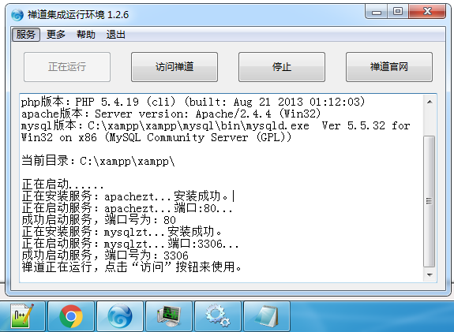
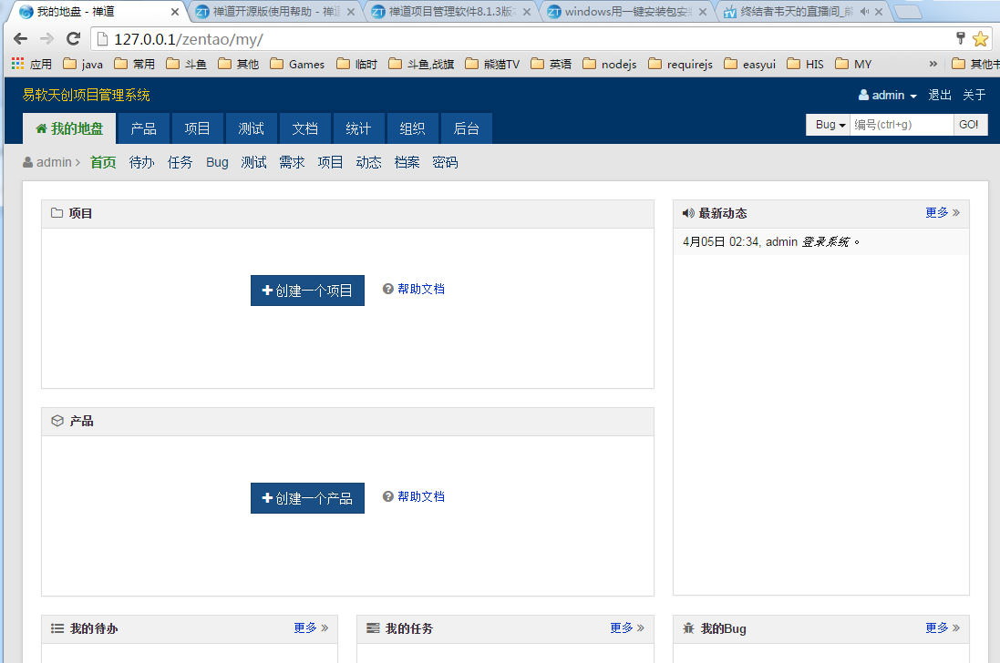
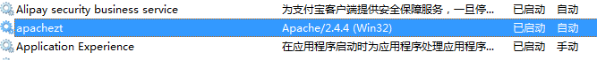
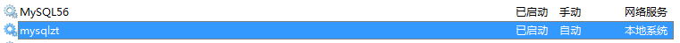
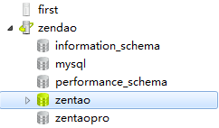

##禅道\(ZenTao\)

####[禅道\(ZenTao\)](http://www.zentao.net/) , [OSC-禅道](http://www.oschina.net/search?user=253318&q=%E7%A6%85%E9%81%93&scope=project)

####安装并启动
- 安装文件我选择的是Windows一键安装包[ZenTaoPMS.8.1.3.exe](http://www.zentao.net/download/79925.html)
- 在[官方下载页面](http://www.zentao.net/download.html)可以下载到最新的开源版本。参考[windows一键安装说明](http://www.zentao.net/book/zentaopmshelp/76.html)。安装过程很快，就像解压某个压缩包。
- 关于安装补充说明：windows下需要安装"Microsoft Visual C++ 2008"。
- 启动后的控制台如图：
- 
- 启动后的HOME界面：
- 
- 启动的apache服务：
- 
- 启动的mysql服务：
- 
- 用navicat.exe打开mysql：
- 

####开始使用禅道
- 准备做一个小项目“新概念英语学习系统”。
- 开始研读禅道的[开源版使用帮助](http://www.zentao.net/book/zentaopmshelp.html)。学习到很多东西。而且，明白了一个道理：有了禅道这样的工具，能够给产品经理项目经理测试经理安心。
-
