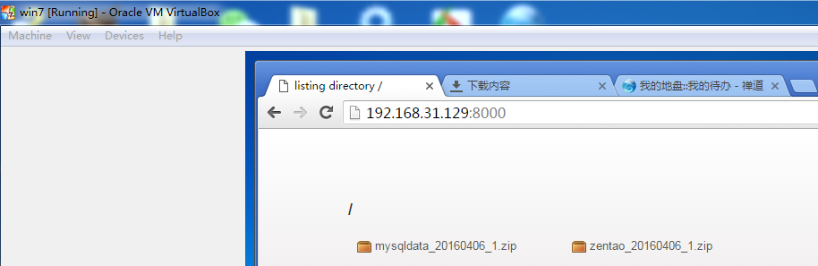
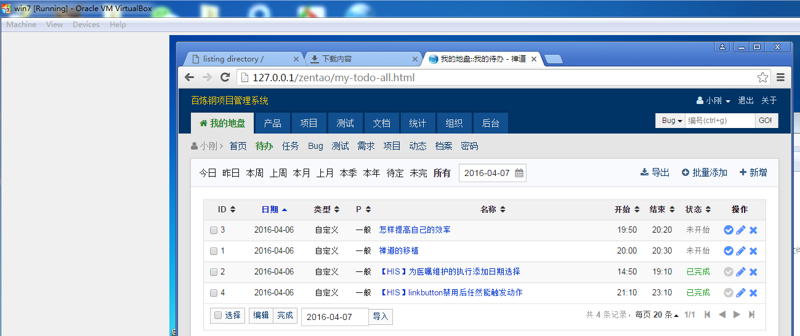

####禅道的移植

#####windows一键安装版的移植。
- [备份禅道](http://www.zentao.net/book/zentaopmshelp/42.html)讲得很明确。
- 
- 由于我的系统有两个mysql服务。所以，我在备份时遇到了障碍。
- mysqldump的用法网上有很多解读。[参考1](http://jingyan.baidu.com/article/948f5924259516d80ef5f95e.html)、[参考2](http://www.cnblogs.com/feichexia/p/MysqlDataBackup.html)、[参考3](http://www.cnblogs.com/qq78292959/p/3637135.html)
- 还是失败，我进入到禅道的安装目录下，找到bin：C:\xampp\xampp\mysql\bin。进入命令行，show databases; 竟然没有数据库。看来采用导出的方式行不通啊。
- 
- 替换mysql/data目录时，出现问题。忽略不能复制的部分。[手工备份](http://www.zentao.net/book/zentaopmshelp/42.html)是可行的，当然备份时记得停止服务。目前我测试的是同版本同操作系统下的windows一键安装版的情况。
- 与Oracle VM VirtualBox进行文件传输采用的是[anywhere](https://github.com/JacksonTian/anywhere)
- 
- 
- 
- 
- 

#####mysql无法启动
- 在移植禅道的过程中发现mysql启动不了。原因是拷贝的不完全。或者说是拷贝之后，重启虚拟机后文件丢失了。
- [mysql_error.err](http://yun.baidu.com/s/1gf6RBBt)中发现: 
	160407  0:28:58 [ERROR] Fatal error: Can't open and lock privilege tables: Can't find file: 'host' (errno: 2)
- [网上参考](http://www.myexception.cn/operating-system/510578.html)： mysql默认数据库文件缺失，查看一下data/mysql目录下的确只有host.frm,而没有host.MYD和host.MYI,于是把自己机器上data/mysql目录下的所有文件拷过去，问题得以解决。
- [最新的mysql_error.err](http://yun.baidu.com/s/1c1PEuzu)，对比。
- 
- 

